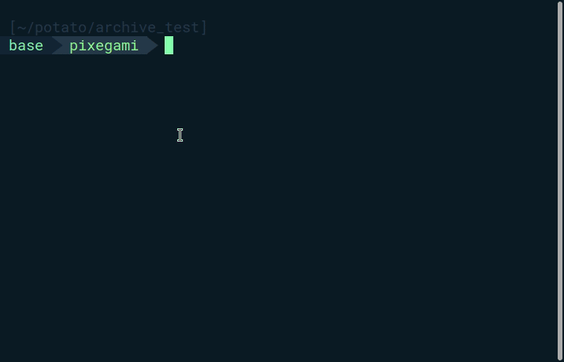

Knowing how to store files on the cloud is an essential capability of many software services. If you wanted to build a product that involved user uploaded images, videos, or music, you would likely need this skill.

In this project, we create a simple archiver that could back-up our unstructured directories, like **Documents** or **Video/Photo** files—anything that you wouldn't use [GitHub](https://github.com/) for.

It's like a stripped down, one-way Dropbox. But with some additional work, you could also add it as part of your back-up automation, and configure it to be more cost-effective for long-term archival use cases.

#### Source Code (GitHub)

I originally created a CLI app project for this, but it became too big for the scope of a short tutorial, so I've stripped down the interesting bits into a bare-bones tutorial version.

[Tutorial Version](https://github.com/pixegami/cloud-archiver-tutorial) | [Original Version (pictured below)](https://github.com/pixegami/cloud-archiver) 



## Specification

When executed, this script will check files and folders *rooted* in the current directory. Any files or folders stale (hasn't been updated) for at least **30 days** will be uploaded to the cloud (AWS) for storage.

* Here, I'll define "staleness" as the **number of days since a file was last modified**.
* We will assume folders contain files and structures that work together 'atomically'. If a folder is selected to be archived, then *all* of its contents must be uploaded. This means a folder's staleness must be determined by the *least* stale file inside it.

## What you will learn

* How to calculate the number of days since a file (or folder) was last accessed.
* **Given a path**: how to list all of the files contained inside it (and all its sub-folders too).
* **Given a list of files**: how to upload it to Amazon S3 (cloud storage).

## Prerequisites

#### Python Environment

Since this is a Python project, I recommend at least some basic experience with Python and Python environments already. Here's a [Getting Started guide](https://www.python.org/about/gettingstarted/).

I recommend using a [virtual environment](https://docs.python.org/3/library/venv.html) for this project, and **Python 3.6** or above.

#### AWS Account and CLI

In this project, we'll use AWS to store our files, so you will need to have an [AWS account](https://aws.amazon.com/free). All the services we use should be well within the free tier limit.

It's also useful to have the [AWS CLI configured](https://aws.amazon.com/cli/) on your desktop. We don't need to use it directly, but the SDK (below) will use the default configurations of the CLI, if it exists.

> Also see [my previous post](./aws-quickstart) about getting started with AWS.

#### Boto3

Our Python script won't use the CLI directly. It will use an AWS SDK, called `boto3` to interact with AWS.  `boto3` will check for your CLI AWS credentials, and use that if it exists.

To install `boto3` in your environment, it's usually just:

```bash
pip install boto3
```

## Implementation

We'll start by creating a Python file. I'll call it `archive.py`, but the name can be whatever you want. Inside, it's just a `main()` function that should run when we execute the script.

```python
def main():
    print("Hello!")
    
if __name__ == "__main__":
    main()
```

Next, we'll be implementing three separate functionality, that we can then combine together:

* A function to get the number of days a file or folder as been stale for.
* A function to get a list of all stale files under a given path.
* A function to upload files to S3.

I kept each function under 20 lines long, just so they can be reasoned about and tested easily. 

#### Unit Testing

Speaking of tests, I've also included some [unit tests](https://github.com/pixegami/cloud-archiver-tutorial/tree/main/test) as part of the project source, which uses the [pytest](https://docs.pytest.org/en/stable/) framework. 

Unit testing is beyond the scope of this tutorial, but you can still check it out if you're curious about how each of these functions can be tested separately.

The tests include creating 'fake' old files and directory structures for the function to execute on, as well as [mocking](https://stackoverflow.com/questions/2665812/what-is-mocking) the AWS S3 client (so we don't actually try to upload to AWS when we test).

## Days stale

#### Days stale of a file

The first function we'll create is `_days_stale_of_file()`. This is easy—we just want to know how long ago (in days) since a file was last accessed. We will use the inbuilt [stat](https://docs.python.org/3/library/stat.html) and [time](https://docs.python.org/3/library/time.html) modules to figure this out.

```python
import os
import time
import stat

def _days_stale_of_file(file_path: str):
    file_stats_result = os.stat(file_path)
    access_time = file_stats_result[stat.ST_ATIME]
    seconds_stale = time.time() - access_time
    
    # Convert from seconds to days.
    days_stale = math.floor(seconds_stale / 86400)
    return days_stale
```

The underscore notation means that it's [intended for private use](https://www.python.org/dev/peps/pep-0008/#descriptive-naming-styles)—we don't expect this function to be called directly by the user, or another external module.

#### Days stale of a folder

If this folder contains a project, or a collection of files that depend on each other, then we want to either archive the *entire* folder, or not at all. 

We'll decide this by looking for the least stale file within that folder and all of its sub-directories, and use that as our value.

First we'll need a function to list all file paths within a directory. I choose to use the built-in [`os.walk()`](https://docs.python.org/3/library/os.html), but there's [other ways](https://stackoverflow.com/questions/3207219/how-do-i-list-all-files-of-a-directory) to do this as well.

```python
# This function will return a list of all files under "path."
def _all_files_in_dir(path: str):
    files = []
    for r, _, f in os.walk(path):
        for file in f:
            sub_path = os.path.join(r, file)
            files.append(sub_path)
    return files
```

Now, we can list all files within the folder, and return the lowest value.

```python
def _days_stale_of_folder(folder_path: str):
    min_stale_days = None
    for file in _all_files_in_dir(folder_path):
        days = _days_stale_of_file(file)
        
        # Set min_stale_days if we find a lower value.
        if min_stale_days is None or days < min_stale_days:
            min_stale_days = days
	
    # If there are no files in this directory, return 0.
    return min_stale_days if min_stale_days is not None else 0
```

#### Days stale of a path

Putting this together, we can now pass in any path, and get a `int` output representing the number of days since this file (or any file in this path) was last accessed.

```python
def days_stale(path: str):
    if os.path.isfile(path):
        return _days_stale_of_file(path)
    else:
        return _days_stale_of_folder(path)
```

## Get stale files

Now, we want to traverse our `root_path` (usually the directory we'll execute the script from) and get a list of all files that we want to archive. This is going to be a list of file paths (string).

First, we should figure out which direct sub-paths are stale. We can use `os.listdir()`, which will only return direct children of the path. 

Then use our previously created `days_stale()` function to decide whether or not to archive it.

```python
stale_sub_paths = []
    for sub_path in os.listdir(root_path):
        path = os.path.join(root_path, sub_path)
        if days_stale(path) >= days_threshold:
            stale_sub_paths.append(path)
```

But because we only executed these on the direct sub-paths of `root_path`, we need an additional step to traverse them and get a list of all files within the path.

```python
stale_files = []
    for sub_path in stale_sub_paths:
        if os.path.isfile(sub_path):
            stale_files.append(sub_path)
        else:
            stale_files += _all_files_in_dir(sub_path)
```

>  Why didn't we just do this in the first step directly, as we were calculating `days_stale()`? 
>
> That's because—in some situations—files that *are* stale still shouldn't be archived (if something else within that scope is still fresh). That's why we need to have a top-down picture first of with paths to archive wholesale.

Finally, we can put it together into a single function.

```python
def get_stale_files(root_path: str, days_threshold: int):
	
    # 1. Get the direct sub-paths that are stale.
    stale_sub_paths = []
    for sub_path in os.listdir(root_path):
        path = os.path.join(root_path, sub_path)
        if days_stale(path) >= days_threshold:
            stale_sub_paths.append(path)
	
    # 2. For each sub-path, get all the files within.
    stale_files = []
    for sub_path in stale_sub_paths:
        if os.path.isfile(sub_path):
            stale_files.append(sub_path)
        else:
            stale_files += _all_files_in_dir(sub_path)

    return stale_files
```

## Uploading to the cloud (Amazon S3)

In this tutorial, we'll use [Amazon S3](https://aws.amazon.com/s3/) to store our files. As of writing, you get about **5GB of free storage** with your account. Similar alternatives include [Azure](https://azure.microsoft.com/en-au/free/storage), [Google Cloud](https://cloud.google.com/storage), and [Digital Ocean](https://try.digitalocean.com/cloud-storage).

At this point, we have a list of files we'll want to upload. It could look something like this:

```
file_8d4df_180d.txt
file_0e81f_180d.txt
test_dir_2/nested_dir_1/file_c50ac_180d.txt
test_dir_2/nested_dir_1/file_923b6_180d.txt
file_a707b_180d.txt
file_6921c_180d.txt
```

#### Bucket name generation

But before we can upload the files, we'll need to create a [bucket](https://docs.aws.amazon.com/AmazonS3/latest/dev/UsingBucket.html) (which is essentially just a 'folder'). The bucket name needs to be globally unique, so we'll create a function to generate one based on the date (for search-ability) and a randomly generated [UUID](https://docs.python.org/3/library/uuid.html).

```python
import uuid
from datetime import datetime

def _generate_unique_bucket_name():
    current_date = datetime.now()
    date_str = current_date.strftime("%Y-%m-%d")
    short_uid = uuid.uuid4().hex[:12]
    bucket_name = f"archive.{date_str}.{short_uid}"
    return bucket_name
```

This will generate a bucket name like `archive.2021-01-02.eb36774453ff`.

> Unique, generated bucket names are an easy way to achieve our goal—but it's not something I'd recommend as a long term solution. We don't want to create a new bucket every time we archive. 
>
> Ideally, we could let the user specify their own bucket name, and then create an S3 key to deal with objects' archive date and scope.

#### Upload to S3

Once we have our unique bucket name, we can finally connect to S3 with our [Python AWS SDK client (called boto)](https://boto3.amazonaws.com/v1/documentation/api/latest/index.html), and create the bucket.

```python
if s3_client is None:
        s3_client = boto3.client("s3")
```

Here, I lazily create the client (unless it was provided as part of the function call). This is so I can mock it during tests.

By default, `boto3` will try to [look for your AWS credentials](https://boto3.amazonaws.com/v1/documentation/api/latest/guide/quickstart.html#configuration) created by the AWS CLI, so that's how it knows which account and region to upload the files to.

Next we'll create the unique bucket.

```python
bucket_name = _generate_unique_bucket_name()
print(f"Creating bucket: {bucket_name}")
s3_client.create_bucket(Bucket=bucket_name)
```

And finally, upload each file.

```python
for i, file_path in enumerate(file_paths):
    print(f"Uploading ({i + 1}/{len(file_paths)}): {file_path}")
    s3_client.upload_file(file_path, bucket_name, file_path)
```

Now we can put it all together into a function.

```python
from botocore.client import BaseClient
import boto3

def upload_to_s3(file_paths: List[str], s3_client: BaseClient = None):
    if s3_client is None:
        s3_client = boto3.client("s3")

    try:
        bucket_name = _generate_unique_bucket_name()
        print(f"Creating bucket: {bucket_name}")
        s3_client.create_bucket(Bucket=bucket_name)

        for i, file_path in enumerate(file_paths):
            print(f"Uploading ({i + 1}/{len(file_paths)}): {file_path}")
            s3_client.upload_file(file_path, bucket_name, file_path)

    except Exception as e:
        print(f"ERROR: Failed uploading to S3: {e}")
```

## Putting it all together

Now it's the easy part! Just use the output of `get_stale_files` and plug it into `upload_to_s3`, and you have a working (albeit basic) cloud archiver app!

```python
def main():
    stale_files = get_stale_files(".", days_threshold=30)
    upload_to_s3(file_paths=stale_files)
```

When you run the app, it will look for files within the folder to archive.

```bash
python archive.py
```

#### Sample output

```
Found stale file: tmp/file_fcd56_180d.txt
Found stale file: tmp/file_3d530_180d.txt
Found stale file: tmp/file_4c150_180d.txt
Found stale file: tmp/file_30fa3_180d.txt
Found stale file: tmp/test_dir_2/nested_dir_1/file_ec00d_180d.txt
Found stale file: tmp/test_dir_2/nested_dir_1/file_be135_180d.txt
Found stale file: tmp/file_21254_180d.txt
Creating bucket: archive.2021-01-02.eb36774453ff
Uploading (1/7): tmp/file_4a7f2_180d.txt
Uploading (2/7): tmp/file_ad372_180d.txt
Uploading (3/7): tmp/test_dir_2/nested_dir_1/file_7b4e7_180d.txt
Uploading (4/7): tmp/test_dir_2/nested_dir_1/file_06140_180d.txt
Uploading (5/7): tmp/file_941e1_180d.txt
Uploading (6/7): tmp/file_a1bd0_180d.txt
Uploading (7/7): tmp/file_4ab40_180d.txt
```

## Next steps

This tutorial and script were pretty basic starting points, so there's some ideas on how you might want to extend it:

* Improve basic functionality by implementing a CLI interface ([with rich](https://github.com/willmcgugan/rich)). Add prompts to move or delete the files that have already been archived. For reference, here is a more [intermediate implementation](https://github.com/pixegami/cloud-archiver) of this app.
* Extend this app to [run in the background](https://stackoverflow.com/questions/1603109/how-to-make-a-python-script-run-like-a-service-or-daemon-in-linux).
* Extend it into a [DropBox](https://www.dropbox.com/) clone, so it can automatically sync files within a directory, across devices.
* Extend the [pytest cases](https://docs.pytest.org/en/stable/), and test for edge cases like looping file structures (shortcuts that are cyclic) and files/folders without 'read' permissions.

